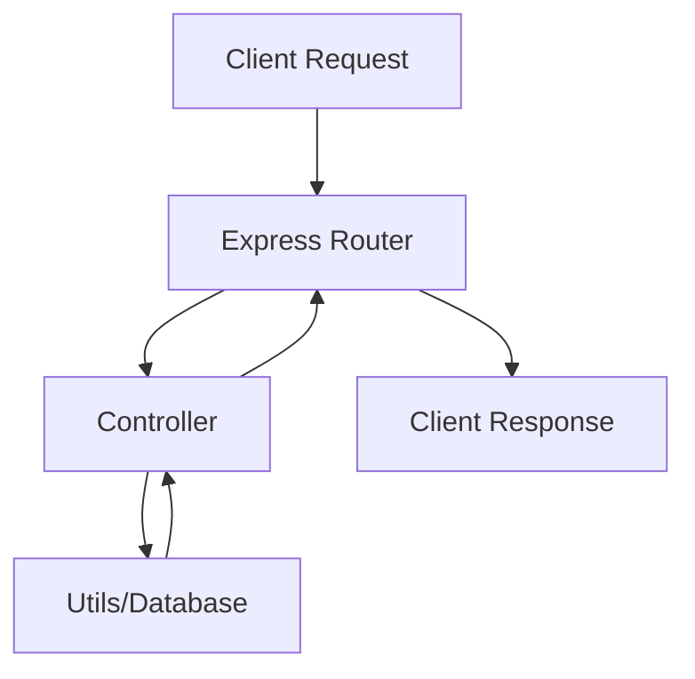

# Serveur Node.js avec Express et ES6

Un serveur Node.js moderne utilisant Express.js et les fonctionnalités ES6, avec une architecture modulaire et des concepts avancés.

## Concepts Techniques Clés

### 1. Méthodes JavaScript Essentielles

#### Reduce

```javascript
// Exemple de reduce pour grouper les étudiants par field
students.reduce((acc, student) => {
  acc[student.field] = acc[student.field] || [];
  acc[student.field].push(student);
  return acc;
}, {});
```

#### Object.keys().sort()

```javascript
// Trie alphabétiquement les clés d'un objet
const fields = { CS: [], SWE: [] };
Object.keys(fields).sort(); // ['CS', 'SWE']
```

### 2. Express.js Concepts

#### Express.Router()

- Crée une instance de routeur modulaire
- Permet la séparation des routes

```javascript
const router = express.Router();
router.get("/students", StudentsController.getAllStudents);
```

### 3. Destructuration et Opérateurs

#### Destructuration d'Objet

```javascript
const { major } = request.params; // Extraction nommée
// VS
const [major] = request.params; // Extraction par position (incorrect ici)
```

#### Opérateur de Coalescence

```javascript
const students = fields[major] || []; // Retourne [] si fields[major] est undefined
```

### 4. Async/Await Patterns

#### Static Async

- `static`: Méthode de classe (pas d'instance requise)
- `async`: Permet l'utilisation d'await

```javascript
static async getAllStudents() {
  // Peut utiliser await
}
```

#### Lecture de Fichier

```javascript
// Asynchrone - Non bloquant
await fs.readFile(filePath, "utf8");
```

## Table des Patterns Courants

| Pattern       | Usage                    | Exemple                                 |
| ------------- | ------------------------ | --------------------------------------- |
| Reduce        | Agrégation de données    | `array.reduce((acc, val) => {...}, {})` |
| Router        | Organisation des routes  | `express.Router()`                      |
| Destructuring | Extraction de propriétés | `const { prop } = obj`                  |
| Async/Await   | Gestion asynchrone       | `async function() { await ... }`        |

## Architecture et Flux de Données



## Bonnes Pratiques

- Séparation des responsabilités (MVC)
- Gestion asynchrone cohérente
- Organisation modulaire du code
- Validation des entrées
- Gestion d'erreurs structurée Serveur Complet en Node.js

Ce projet présente une implémentation basique d'un serveur Node.js utilisant le framework Express.js avec les fonctionnalités modernes d'ES6.

## Architecture du Projet

### Structure des Dossiers

```
full_server/
│
├── controllers/
│   ├── AppController.js
│   └── StudentsController.js
├── routes/
│   └── index.js
├── utils.js
└── server.js
```

### Composants Principaux

1. **Modules ES6**

- Utilisation de la syntaxe `import/export`
- Organisation modulaire du code
- Configuration via `"type": "module"` dans package.json

2. **Framework Express**

- Framework web pour Node.js
- Gestion du routage et des middlewares
- Traitement simplifié des requêtes HTTP

3. **Contrôleurs**

- Gestion de la logique métier
- Traitement des requêtes
- Séparation par fonctionnalité

4. **Routes**

- Définition des points d'accès API
- Association URL-contrôleurs
- Organisation modulaire

5. **Interface de Données**

- Lecture des fichiers CSV
- Traitement des informations étudiantes
- Formatage des réponses API

## Concepts Fondamentaux

### Gestion des Routes

- Extraction des paramètres via `request.params`
- Filtrage par spécialité (`/students/:major`)
- Routage modulaire et flexible

### Manipulation des Données

- Utilisation optimisée des objets (accès O(1))
- Structure clé-valeur pour données complexes
- Fonctions utilitaires dans `utils.js`

### Flux d'Exécution

1. Configuration initiale (server.js)
2. Définition des routes (routes/index.js)
3. Traitement par les contrôleurs
4. Utilisation des fonctions utilitaires
5. Envoi des réponses JSON

## Fonctionnalités Clés

- Points d'accès API RESTful
- Opérations fichiers asynchrones
- Gestion des erreurs
- Architecture modulaire
- Séparation claire du code

## Démarrage du Serveur

```bash
npm run dev
```
