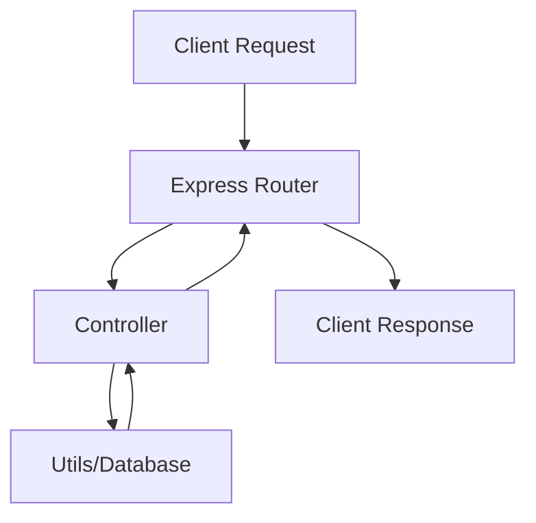

# Serveur Node.js avec Express et ES6

Un serveur Node.js moderne utilisant Express.js et les fonctionnalités ES6, avec une architecture modulaire et des concepts avancés. Ce projet gère des données étudiantes extraites d'une base CSV et expose des API RESTful.

## Table des Matières

1. [Concepts Techniques Clés](#concepts-techniques-clés)
   - [Méthodes JavaScript Essentielles](#méthodes-javascript-essentielles)
   - [Express.js Concepts](#expressjs-concepts)
   - [Destructuration et Opérateurs](#destructuration-et-opérateurs)
   - [Async/Await Patterns](#asyncawait-patterns)
2. [Structure du Projet](#structure-du-projet)
3. [Détails Supplémentaires](#détails-supplémentaires)
   - [Pourquoi utiliser des classes statiques, des constructeurs ou des fonctions séparées ?](#pourquoi-utiliser-des-classes-statiques-des-constructeurs-ou-des-fonctions-séparées)
   - [Gestion des Paramètres dans request.params](#gestion-des-paramètres-dans-requestparams)
   - [Singleton dans ce Projet](#singleton-dans-ce-projet)
4. [Architecture et Flux de Données](#architecture-et-flux-de-données)
5. [Bonnes Pratiques](#bonnes-pratiques)
6. [Exemple d'Architecture Modulaire Étendue](#exemple-darchitecture-modulaire-étendue)
7. [Démarrage du Serveur](#démarrage-du-serveur)

## Concepts Techniques Clés

### Méthodes JavaScript Essentielles

#### Reduce

La méthode `reduce` est un outil puissant pour transformer un tableau en une valeur unique, qu'il s'agisse d'un nombre, d'un objet ou même d'une chaîne de caractères. Voici un exemple adapté à ce projet :

**Fonctionnement :**

1. `reduce` parcourt chaque élément du tableau.
2. L'argument `acc` (accumulateur) contient la valeur qui est accumulée au fil des itérations.
3. L'argument `student` est l'élément courant du tableau.
4. Une fonction de rappel définit la logique de regroupement.

Exemple : Grouper les étudiants par leur champ d'étude (`field`) :

```javascript
const groupedStudents = students.reduce((acc, student) => {
  // Si le champ n'existe pas dans l'accumulateur, on le crée
  acc[student.field] = acc[student.field] || [];

  // On ajoute le prénom de l'étudiant au tableau correspondant
  acc[student.field].push(student.firstname);

  return acc;
}, {});

console.log(groupedStudents);
```

**Sortie attendue :**
Pour un tableau `students` comme :

```javascript
[
  { firstname: "John", field: "CS" },
  { firstname: "Jane", field: "CS" },
  { firstname: "Alice", field: "SWE" }
];
```

Le résultat sera :

```javascript
{
  CS: ['John', 'Jane'],
  SWE: ['Alice']
}
```

**Utilité dans ce projet :**
Cette méthode est utilisée pour regrouper les étudiants par spécialité avant de présenter les résultats dans une réponse API.

#### Object.keys().sort()

La méthode `Object.keys()` retourne un tableau contenant les noms des clés d'un objet. Cette méthode est très utile pour parcourir ou manipuler dynamiquement les propriétés d'un objet.

La méthode `sort()` trie les éléments d'un tableau en place et les retourne. Par défaut, elle trie les éléments en ordre croissant selon l'ordre Unicode.

**Fonctionnement :**

1. `Object.keys(obj)` extrait les clés d'un objet et les retourne sous forme de tableau.
2. `sort()` trie ce tableau alphabétiquement.

**Exemple dans ce projet :**
Voici un exemple où les clés d'un objet représentant des spécialités sont triées avant d'être utilisées :

```javascript
const fields = { CS: [], SWE: [] };

// Extraction et tri des clés
const sortedFields = Object.keys(fields).sort();
console.log(sortedFields); // ['CS', 'SWE']
```

**Utilité dans ce projet :**
Cette combinaison est utilisée pour afficher les spécialités des étudiants dans un ordre prédéfini (alphabétique) lors de la création des réponses API. Cela garantit une présentation cohérente et prévisible des données, quelle que soit l'ordre d'ajout des clés dans l'objet initial.

### Express.js Concepts

#### Express.Router()

- Crée une instance de routeur modulaire
- Permet la séparation des routes

```javascript
const router = express.Router();
router.get("/students", StudentsController.getAllStudents);
```

### Destructuration et Opérateurs

#### Destructuration d'Objet

La destructuration d'objet permet d'extraire des valeurs spécifiques d'un objet en utilisant leur nom de propriété, simplifiant ainsi l'accès aux données.

**Fonctionnement :**

1. La syntaxe `{ propertyName }` extrait directement la valeur de la propriété correspondante d'un objet.
2. Cela évite d'accéder à la valeur via l'objet entier, comme `object.propertyName`.

**Exemple dans ce projet :**

```javascript
// Destructuration correcte
const { major } = request.params; // Accède à la clé "major" directement
console.log(major); // Affiche la valeur associée au paramètre major

// Méthode incorrecte
const [major] = request.params; // Tenter d'accéder par position, ce qui est invalide
```

**Utilité dans ce projet :**
Dans une route comme `/students/:major`, Express place les paramètres d'URL dans `request.params`. La destructuration permet d'extraire directement le paramètre `major` sans avoir à parcourir ou manipuler l'objet `request.params`. Cela simplifie la lecture du code et réduit les erreurs potentielles.

#### Opérateur de Coalescence

```javascript
const students = fields[major] || []; // Retourne [] si fields[major] est undefined
```

### Async/Await Patterns

#### Static Async

- `static`: Méthode de classe (pas d'instance requise)
- `async`: Permet l'utilisation d'await

```javascript
static async getAllStudents() {
  // Peut utiliser await
}
```

#### Lecture de Fichier

```javascript
// Asynchrone - Non bloquant
await fs.readFile(filePath, "utf8");
```

## Structure du Projet

```
full_server/
├── controllers/          # Logique métier
│   ├── AppController.js   # Contrôleur principal
│   └── StudentsController.js  # Gestion des étudiants
├── routes/              # Définition des routes
│   └── index.js
├── utils/              # Fonctions utilitaires
│   └── database.js      # Accès aux données
├── models/             # Modèles de données
│   └── student.js        # Classe représentant un étudiant
└── server.js          # Point d'entrée
```

## Détails Supplémentaires

### Pourquoi utiliser des classes statiques, des constructeurs ou des fonctions séparées ?

#### Classes Statiques

Les classes statiques sont utiles lorsque vous avez des méthodes ou des fonctions qui ne nécessitent pas de créer une instance de classe. Par exemple, dans ce projet :

- **AppController** utilise des méthodes statiques, car elles n'ont pas besoin d'accéder à des propriétés spécifiques à une instance.

```javascript
class AppController {
  static getHomepage(request, response) {
    response.status(200).send("Hello Holberton School!");
  }
}
```

#### Constructeurs

Les constructeurs sont utiles lorsque vous avez besoin d'initialiser des propriétés spécifiques à chaque instance d'une classe.

```javascript
class Student {
  constructor(firstname, field) {
    this.firstname = firstname;
    this.field = field;
  }
}

const student = new Student("John", "CS");
```

### Gestion des Paramètres dans `request.params`

Pour une URL `/students/CS`, Express extrait `CS` et le place dans `request.params.major`.

```javascript
const { major } = request.params;
```

### Singleton dans ce Projet

Un singleton est une classe qui garantit qu'une seule instance de cette classe peut exister.

```javascript
class Database {
  constructor() {
    if (Database.instance) {
      return Database.instance;
    }
    this.connection = {};
    Database.instance = this;
  }
}
```

## Architecture et Flux de Données



## Bonnes Pratiques

Pour assurer une gestion optimale et un code maintenable dans ce projet, voici des recommandations structurées :

### Séparation des Responsabilités (MVC)

- **Contrôleurs** : Responsables de gérer la logique métier et de coordonner les actions nécessaires pour répondre à une requête utilisateur.
  - Exemple : `AppController.js` pour la route d'accueil et `StudentsController.js` pour gérer les données des étudiants.
- **Routes** : Définir les points d’entrée API et associer chaque route à son contrôleur correspondant.
  - Exemple : `routes/index.js` centralise toutes les routes.
- **Modèles** : Représentent la structure des données utilisées.
  - Exemple : `student.js` pour structurer les informations d’un étudiant.

### Gestion Asynchrone Cohérente

- Toujours utiliser `async/await` pour simplifier le traitement des opérations asynchrones, comme la lecture de fichiers ou les requêtes API.
  - Exemple :
    ```javascript
    try {
      const data = await readDatabase(filePath);
      console.log(data);
    } catch (error) {
      console.error("Erreur :", error.message);
    }
    ```
- Manipuler les erreurs de manière centralisée en implémentant un middleware de gestion des erreurs (exemple dans `middlewares/errorHandler.js`).

### Organisation Modulaire du Code

- Diviser les fonctionnalités dans des fichiers distincts selon leur domaine de responsabilité.
  - Exemple :
    - `utils/database.js` : lecture et traitement des données CSV.
    - `services/studentService.js` : logique métier avancée pour les étudiants.

### Validation des Entrées

- Toujours valider les données des utilisateurs avant de les utiliser pour éviter des erreurs ou des attaques potentielles.
  - Exemple : Vérification des paramètres requis pour la route `/students/:major` dans `StudentsController.js` :
    ```javascript
    if (major !== "CS" && major !== "SWE") {
      response.status(400).send("Major parameter must be CS or SWE");
      return;
    }
    ```

### Gestion d’Erreurs Structurée

- Fournir des messages d’erreur clairs et cohérents aux utilisateurs.
- Exemple : Lancer une erreur personnalisée si la base de données ne peut pas être chargée :
  ```javascript
  throw new Error("Cannot load the database");
  ```
- Utiliser un middleware d’erreurs pour capturer et traiter toutes les exceptions :
  ```javascript
  app.use((err, req, res, next) => {
    res.status(err.status || 500).send({ error: err.message });
  });
  ```

En suivant ces bonnes pratiques, vous garantissez un code propre, extensible et facile à maintenir.

-

## Exemple d'Architecture Modulaire Étendue

```
full_server/
├── config/               # Configuration de l'application
│   ├── db.js             # Configuration de la base de données
│   └── server.js         # Configuration du serveur
├── controllers/          # Logique métier
│   ├── AppController.js   # Contrôleur principal
│   └── StudentsController.js  # Gestion des étudiants
├── middlewares/          # Middlewares Express
│   ├── authMiddleware.js # Middleware d'authentification
│   └── errorHandler.js   # Gestion des erreurs
├── routes/               # Définition des routes
│   ├── index.js          # Routes principales
│   └── studentRoutes.js  # Routes pour les étudiants
├── services/             # Services pour la logique métier avancée
│   └── studentService.js # Gestion des étudiants côté métier
├── utils/                # Fonctions utilitaires
│   ├── database.js       # Accès aux données CSV
│   └── helpers.js        # Fonctions d'aide générales
├── models/               # Modèles de données
│   ├── student.js        # Représentation d'un étudiant
│   └── major.js          # Représentation des spécialités
└── server.js             # Point d'entrée
```

## Démarrage du Serveur

```bash
npm run dev
```
